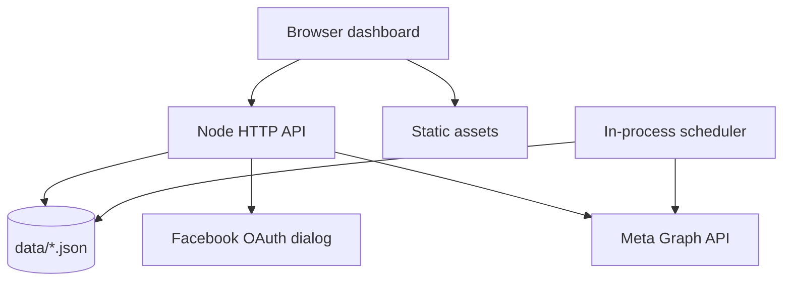

# Architecture

## Components

| Component | Responsibility |
| --- | --- |
| `public/index.html` | Main dashboard structure |
| `public/styles.css` | Responsive application styling |
| `public/app.js` | Browser state, API calls, rendering, setup checklist |
| `src/server.js` | HTTP server, static files, API routes, OAuth, Graph API, scheduler |
| `data/` | Runtime JSON files ignored by Git |
| `Dockerfile` | Production image |
| `docker-compose.yml` | Local container orchestration |
| `render.yaml` | Render Blueprint |
| `.github/workflows/` | CI and optional Render deploy trigger |

## Runtime

The app is a single-service web application. The same Node process serves static frontend files and JSON API responses. There is no separate frontend build step, no database service, and no WebSocket runtime.

## OAuth Flow

1. The operator configures `FACEBOOK_APP_ID`, `FACEBOOK_APP_SECRET`, and `GRAPH_VERSION`.
2. The browser opens `/auth/login`.
3. The server creates an OAuth state value and redirects to Facebook Login with Page permissions.
4. Facebook redirects back to `/auth/callback`.
5. The server validates state, exchanges the code for a user token, exchanges for a longer-lived token when available, and calls `me/accounts`.
6. Page metadata and Page access tokens are stored in `data/auth.json`.
7. The dashboard loads Pages through `/api/pages`; access tokens are never returned to the browser.

## Publishing Flow

1. The browser submits a Page ID, message, and optional link to `/api/posts`.
2. The server finds the matching Page access token in `data/auth.json`.
3. The server posts to `/{pageId}/feed` through Meta Graph API.
4. Success or failure is recorded in `data/activity.json`.

## Scheduling Flow

1. The browser submits a local publish time to `/api/jobs`.
2. The server stores the job in `data/jobs.json` with status `scheduled`.
3. A server interval checks due jobs every 30 seconds.
4. Due jobs are published through the same Page feed flow.
5. Jobs become `published` or `failed`.

## HTTP Boundaries

| Prefix | Purpose | Authentication |
| --- | --- | --- |
| `/` and static files | Dashboard assets | Public |
| `/health` | Health check | Public |
| `/api/status` | Setup state and callback URL | Public |
| `/api/config` | Read masked config or save config | Public in current personal app |
| `/api/pages` | List connected Pages without tokens | Public in current personal app |
| `/api/posts` | Publish a Page post | Public in current personal app |
| `/api/jobs` | Manage local scheduled jobs | Public in current personal app |
| `/api/activity` | Read activity log | Public in current personal app |
| `/auth/*` | Facebook OAuth | Public |

## Data Ownership

| Data | Owner / Storage |
| --- | --- |
| Meta App ID | Render env or `data/config.json` |
| Meta App Secret | Render env or `data/config.json` |
| User access token | `data/auth.json` |
| Page access tokens | `data/auth.json` |
| Scheduled posts | `data/jobs.json` |
| Activity log | `data/activity.json` |
| Frontend state | Browser memory only |

## Known Architecture Gaps

* There is no app-level login for the dashboard.
* JSON runtime storage is not appropriate for multiple app replicas.
* There is no queue worker separate from the web process.
* Render restarts can interrupt scheduled jobs unless data is persisted and the service is awake.
* Graph API permission review is an external Meta process.
