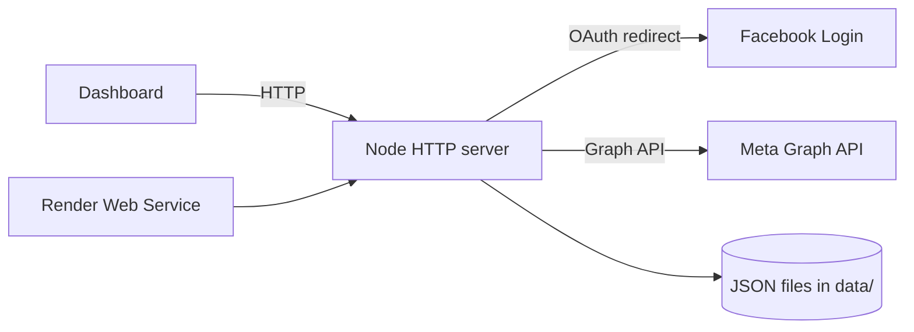

# Project Context

## Purpose

FB Page Manager is a small personal web app for managing Facebook Page publishing through the official Meta Graph API. It is intentionally not a browser-automation or account-password tool.

The app helps one operator connect a Meta app, authorize Facebook Pages, publish status/link/photo/video/product-style Page posts, and keep lightweight local schedules and activity logs.

## Current State

| Area | State | Primary Location |
| --- | --- | --- |
| Frontend | Implemented plain HTML/CSS/JS dashboard with Vietnamese UI | `public/` |
| Backend | Implemented Node.js HTTP server using only built-in modules | `src/server.js` |
| Auth | Facebook OAuth login and callback flow | `/auth/login`, `/auth/callback` |
| Graph API | Page listing plus Page feed/photo/video publishing | `src/server.js` |
| Storage | Local JSON files mounted as runtime data | `data/` |
| Scheduler | In-process interval checks scheduled jobs | `src/server.js` |
| DevOps | Docker, Compose, Render Blueprint, GitHub Actions | `Dockerfile`, `docker-compose.yml`, `render.yaml`, `.github/` |

## Runtime Summary



The server owns the Facebook App Secret and exchanges OAuth codes for user/Page access tokens. Tokens and scheduled jobs are stored in local JSON files under `data/`. In production on Render, the service should use a persistent disk mounted to `/usr/src/app/data` if tokens and schedules must survive restarts.

## Implemented User Flows

| Flow | Status |
| --- | --- |
| Public dashboard served from one web service | Implemented |
| Vietnamese setup checklist and settings UI | Implemented |
| Health endpoint for Docker/Render | Implemented |
| Save Meta App ID/App Secret locally or via environment | Implemented |
| Facebook OAuth login | Implemented |
| Read manageable Pages through `me/accounts` | Implemented |
| Publish status/link posts to Page feed | Implemented |
| Publish Page photos, multi-photo posts, and videos from public URLs | Implemented |
| Publish product-style posts to a Page | Implemented |
| Create local scheduled posts | Implemented |
| Process due scheduled posts while the service is running | Implemented |
| Activity log for local actions and API failures | Implemented |
| GitHub CI and Render Blueprint deployment | Implemented |

## Technical Constraints

| Constraint | Handling |
| --- | --- |
| Must not collect Facebook account passwords | Uses OAuth only |
| Must not automate Facebook browser sessions | Uses Graph API endpoints only |
| App Secret must remain server-side | Stored in env/local JSON; never sent to frontend except masked |
| Scheduled posts need a running process | In-process scheduler only checks while server is alive |
| Local JSON storage is single-instance | Use one service instance; avoid horizontal scaling without a database |
| Render free instances may sleep/restart | Use persistent disk for durable `data/` if needed |

## Remaining Work / Blockers

| Area | Gap |
| --- | --- |
| Meta App | Production use requires valid `FACEBOOK_APP_ID`, `FACEBOOK_APP_SECRET`, and OAuth callback |
| Permissions | Facebook Page permissions may require Meta app review outside tester/admin accounts |
| Storage | JSON files are simple; no database or migrations |
| Scheduling | No distributed worker, retry policy, or timezone-specific calendar view |
| Group/Marketplace | Direct group posting and Marketplace product publishing are intentionally unsupported without an official API path for this app |
| Operations | No central logs, metrics, backup, or secret rotation workflow |

## Validation Entry Points

```bash
npm ci
npm run check
docker compose config
docker compose up --build
```

Public health:

```text
https://fplus36h.onrender.com/health
```

## Future Session Startup

1. Read `docs/project_context.md`, `docs/changelog.md`, and `docs/decisions.md`.
2. Read task-relevant source in `src/` and `public/`.
3. Keep docs, commit history, and Render deployment behavior synchronized after code changes.
