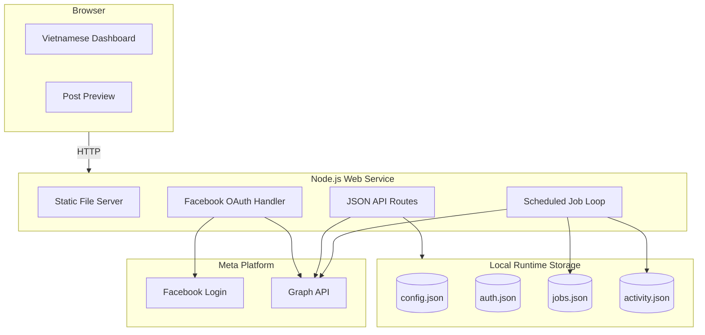
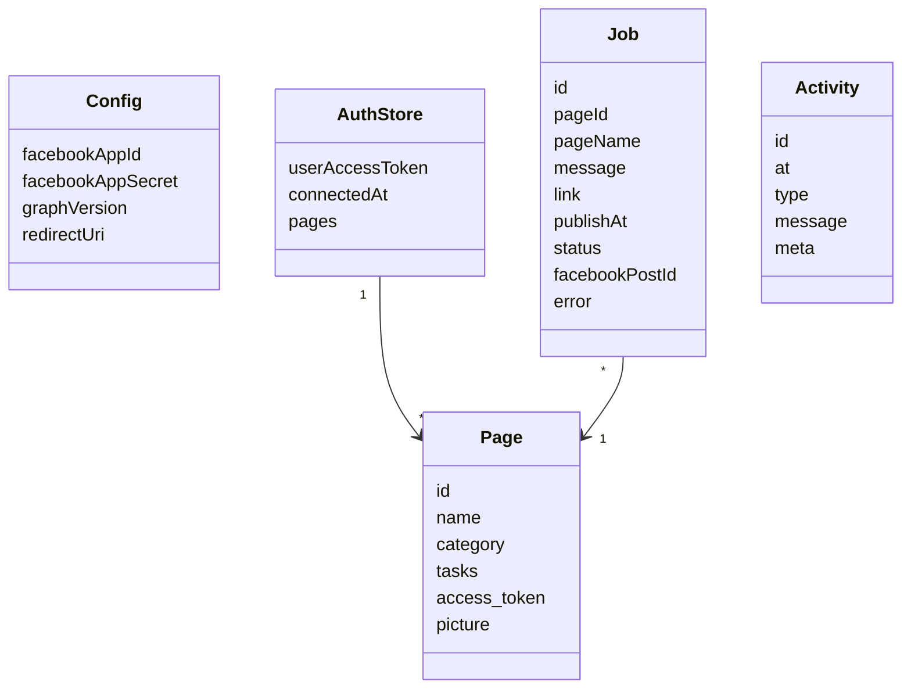

#### 3. Architectural Design

##### 1.1 Architecture Diagram

* **Written by**: Nguyen Ngoc Tuan / project owner
* **Edited by**: Codex
* **Reviewed by**:

## A. System Decomposition

FB Page Manager is designed as a small single-service web application:

1. **Browser UI Layer**: Plain HTML/CSS/JS dashboard for setup, Page selection, post composing, scheduling, and activity review.
2. **Application Server Layer**: Node.js HTTP server for static files, APIs, OAuth, Meta Graph API calls, and scheduled job processing.
3. **Runtime Storage Layer**: JSON files in `data/` for config, tokens, jobs, and activity logs.
4. **External Platform Layer**: Facebook Login and Meta Graph API for Page access and publishing.
5. **Deployment Layer**: Docker image deployed locally through Compose and publicly through Render.

## B. Overall System Architecture Diagram

## C. Core Data Model

## D. Key Design Notes

* The browser never receives Page access tokens.
* Facebook account password login is intentionally not implemented.
* The scheduler is in-process and suitable for one personal deployment.
* Runtime JSON data must be persisted outside the container if schedules/tokens must survive restarts.
* The current implementation is not a multi-tenant SaaS product.
